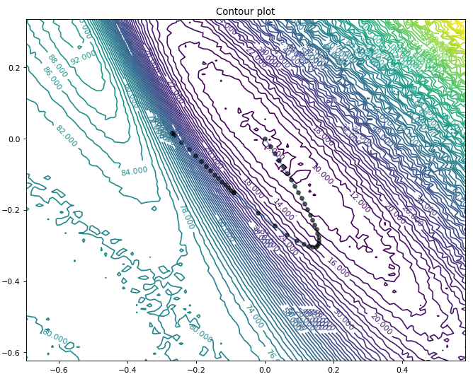
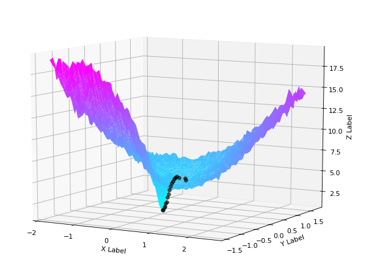
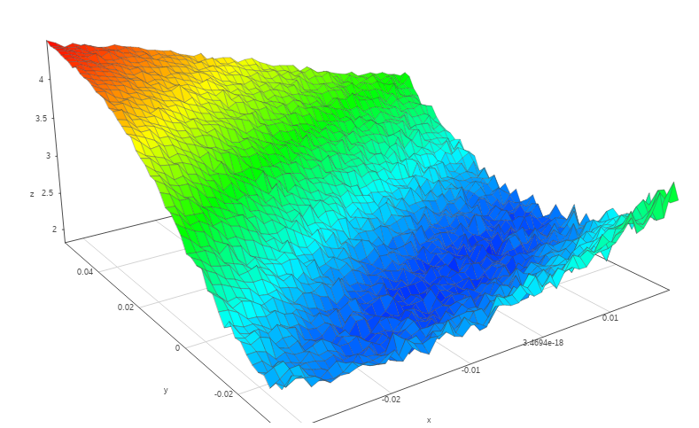

# GradVis

A DNN Training Visualization Toolbox

Original Paper: [arxiv.org/abs/1909.12108](arxiv.org/abs/1909.12108)

## Usage

### Import using 

```python
import Visualization as vis
import nn_model
import trajectory_plots as tplot
```

### Main function is `visualize`:

```python
vis.visualize(nnmodel,filenames,N,save_as,random_dir=False,proz=0.5,v_vec=[],w_vec=[],verbose=False)
```

Inputs:

    - nnmodel: instance of nn_model class
    - filename: array of filename of parameters one wishes to plot
    - N: number of values in x,y direction. Defines the resolution of the loss landscape
    - save_as: filename of file to be saved
    - random_dir: If one wants to only plot the loss surface at arbitrary directions around one point use `True`
    - proz: Plot additional fraction of the plot (have border around path when plotting)
    - v_vec,w_vec: For plots in direction of those vectors

Outputs:
    
    - Numpy .npz file which stores the following data:

    If random_dir=False and no vectors specified:
        (X,Y,Z),(Paths_x,y,z),(variation of PCA diections, v vector, w vector)
    If random_dir=False and v_vec,w_vec specified:
        (X,Y,Z),(Paths_x,y,z)
    If random_dir=True:
        (X,Y,Z),(v vector, w vector)


### The `nn_model` instance is created as follows:

```python
nn_model.PyTorch_NNModel(model,train,converged_params)
```

Inputs:

    - model: PyTorch neural network model
    - train: function returning loss value of model (basically training function without doing backpropagation or updating the gradients)
    - converged_params: filename of the converged parameters

### For plotting there are three functions:

#### 2D contour plots using `plot_loss_2D`:

```python
tplot.plot_loss_2D(filename,save_as,is_log=False)
```
Plot contour of loss function

Inputs:

    - filename: path to file that was created using `visualize`
    - save_as: filename of plot to be saved
    - is_log: plot loss landscape in log plot
    




#### 3D contour plots using `plot_loss_3D`:

```python
tplot.plot_loss_3D(filename,save_as,is_log=False)
```
Create 3D plot of loss landscape with optional path

Inputs:

    - filename: path to file that was created using `visualize`
    - save_as: filename of plot to be saved
    - is_log: plot loss landscape in log plot



#### Interactive 3D plots using `plot3D`:

```python
tplot.plot3D(X, Y, Z, height=600, xlabel = "X", ylabel = "Y", zlabel = "Z", initialCamera = None)
```
Make an interactive 3D plot (mainly helpful for jupyterlab)

Inputs:
    X,Y,Z values of loss landscape




## Examples

Two examples are provided showing different use-cases:

 - Multiple_minima.py: Allows multiple minima plotting.

 - Resnet_vis.py: Plots loss landscape of a Resnet20 in 2D and 3D.
